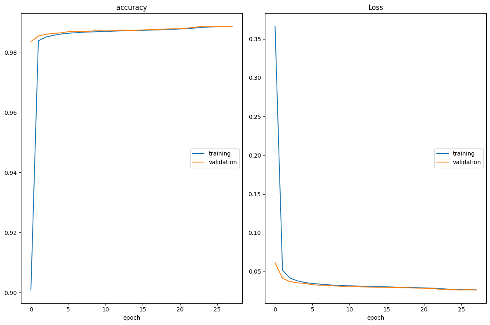

## Neural Machine Translation (seq2seq): English → Predicate Logic

Predicate logic, first-order logic or quantified logic is a formal language in which propositions are expressed in terms of predicates, variables and quantifiers.
It is different from propositional logic which lacks quantifiers.

It should be viewed as an extension to propositional logic, in which the notions of truth values, logical connectives, etc still apply but propositional letters(which used to be atomic elements), will be replaced by a newer notion of proposition involving predicates and quantifiers.

```
Input sentence: every cat likes fish
Decoded sentence: 'all x1.(_cat(x1) -> exists x2.(_fish(x2) & _like(x1,x2)))'

Input sentence: some people are evil and some people are good
Decoded sentence: 'exists x1.(_people(x1) & _good(x1)) & exists x2.(_people(x2) & _evil(x2))'

Input sentence: she is willing and able
Decoded sentence: 'exists x1.(_able(x1) & _willing(x1))'
```

<br/>

### Models

1. Plain LSTM
2. Plain GRU
3. Bi-directional GRU + Attention (Bahdanau, 2014)
4. Bi-directional LSTM + Attention

<br/>

## Experiment Env.

```
# Make python packagelist.txt
conda list --export > packagelist.txt

# Using packagelist.txt file
# This file may be used to create an environment using:
# $ conda create --name <env> --file <this file>
# platform: osx-arm64
```

<br/>

<br/>

## Windows

### Data Info.

```
Stats:
------------------------
------------------------
N(X) == N(y) == 40000
errs: 0
Clean data (N = 40000) ratio: 100.0%
------------------------
```

### Model Info.

```
__________________________________________________________________________________________________
 Layer (type)                   Output Shape         Param #     Connected to                     
==================================================================================================
 input_19 (InputLayer)          [(None, None, 37)]   0           []                               
                                                                                                  
 bidirectional_encoder (Bidirec  [(None, None, 88),  28864       ['input_19[0][0]']               
 tional)                         (None, 44),                                                      
                                 (None, 44),                                                      
                                 (None, 44),                                                      
                                 (None, 44)]                                                      
                                                                                                  
 input_21 (InputLayer)          [(None, None, 45)]   0           []                               
                                                                                                  
 concatenate_6 (Concatenate)    (None, 88)           0           ['bidirectional_encoder[0][1]',  
                                                                  'bidirectional_encoder[0][3]']  
                                                                                                  
 concatenate_7 (Concatenate)    (None, 88)           0           ['bidirectional_encoder[0][2]',  
                                                                  'bidirectional_encoder[0][4]']  
                                                                                                  
 decoder_lstm (LSTM)            [(None, None, 88),   47168       ['input_21[0][0]',               
                                 (None, 88),                      'concatenate_6[0][0]',          
                                 (None, 88)]                      'concatenate_7[0][0]']          
                                                                                                  
 attention_layer (AttentionLaye  ((None, None, 88),  15576       ['bidirectional_encoder[0][0]',  
...
Total params: 99,573
Trainable params: 99,573
Non-trainable params: 0
__________________________________________________________________________________________________
```

### Train

```
accuracy
	training         	 (min:    0.901, max:    0.989, cur:    0.989)
	validation       	 (min:    0.984, max:    0.989, cur:    0.989)
Loss
	training         	 (min:    0.026, max:    0.366, cur:    0.026)
	validation       	 (min:    0.026, max:    0.061, cur:    0.026)

Epoch 28: val_loss did not improve from 0.02627
563/563 [==============================] - 532s 945ms/step - loss: 0.0264 - accuracy: 0.9887 - val_loss: 0.0263 - val_accuracy: 0.9886
Epoch 28: early stopping
```



### Recognition

```

```

<br/>

<br/>

## Linux

### Data Info.

```

```

### Model Info.

```

```

### Train

```

```

### Recognition

```

```

<br/>

<br/>

## Hadoop

### Data Info.

```

```

### Model Info.

```

```

### Train

```

```

### Recognition

```

```

### Detection

```

```

<br/>

<br/>

## HDFS

### Data Info.

```

```

### Model Info.

```

```

### Train

```

```

### Recognition

```

```

### Detection

```

```
